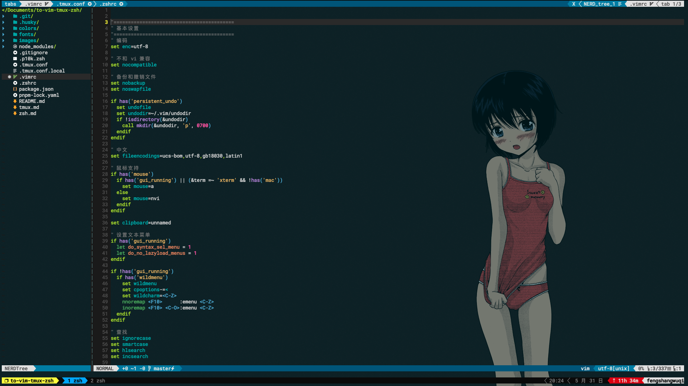

> # to-vim-tmux-zsh

## 使用

```
# 克隆仓库

$ git clone git@github.com:FengShangWuQi/to-vim-tmux-zsh.git

# 安装依赖

- vim 插件管理 vim-plug，然后使用 :PlugInstall 安装 vim 插件；
- vim 主题 solarized；
- tmux 插件管理: tpm，然后使用 prefix + I 安装 tmux 插件；
- oh-my-zsh；
- powerline-fonts；
- iterm2（可选）；

# 建立相关配置文件的软链接，方便直接更新

$ ln -s ~/Documents/to-vim-tmux-zsh/.vimrc ~/.vimrc
$ ln -s ~/Documents/to-vim-tmux-zsh/.tmux.conf ~/.tmux.conf
$ ln -s ~/Documents/to-vim-tmux-zsh/.tmux.conf.local ~/.tmux.conf.local
$ ln -s ~/Documents/to-vim-tmux-zsh/.zshrc ~/.zshrc
```

- [vim-plug](https://github.com/junegunn/vim-plug)
- [vim-colors-solarized](https://github.com/altercation/vim-colors-solarized)
- [tpm](https://github.com/tmux-plugins/tpm)
- [oh-my-zsh](https://ohmyz.sh/)
- [powerline-fonts](https://github.com/powerline/fonts)
- [iterm2](https://www.iterm2.com/)

## 截图



### vim

彪悍的编译器，不需要解释

### tmux

一个窗口，帮你搞定所有

### zsh

非常棒的 shell，没理由再使用 bash
