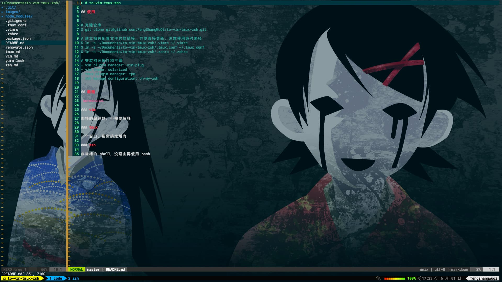

> # to-vim-tmux-zsh

## 使用

### 配置文件

```
# 克隆仓库
$ git clone git@github.com:FengShangWuQi/to-vim-tmux-zsh.git

# 建立相关配置文件的软链接，方便直接更新，注意使用绝对路径
$ ln -s ~/Documents/to-vim-tmux-zsh/.vimrc ~/.vimrc
$ ln -s ~/Documents/to-vim-tmux-zsh/.tmux.conf ~/.tmux.conf
$ ln -s ~/Documents/to-vim-tmux-zsh/.zshrc ~/.zshrc
```

### 安装依赖

```
# vim 插件管理: vim-plug
- 使用 :PlugInstall 安装 vim 插件，其他命令参考官方文档；

# vim 主题: solarized
- 按照官方文档将主题下载并导入对应目录；

# tmux 插件管理: tpm
- 使用 prefix + I 安装 tmux 插件，其他命令参考官方文档；

# zsh
- oh-my-zsh

# powerline-fonts
- 可以下载安装所有字体，也可以使用本仓库备用的 Roboto Mono Medium for Powerline 字体；

# iterm2（可选）
```

- [vim-plug](https://github.com/junegunn/vim-plug)
- [vim-colors-solarized](https://github.com/altercation/vim-colors-solarized)
- [tpm](https://github.com/tmux-plugins/tpm)
- [oh-my-zsh](https://ohmyz.sh/)
- [powerline-fonts](https://github.com/powerline/fonts)
- [iterm2](https://www.iterm2.com/)

## 截图



### vim

彪悍的编译器，不需要解释

### tmux

一个窗口，帮你搞定所有

### zsh

非常棒的 shell，没理由再使用 bash
