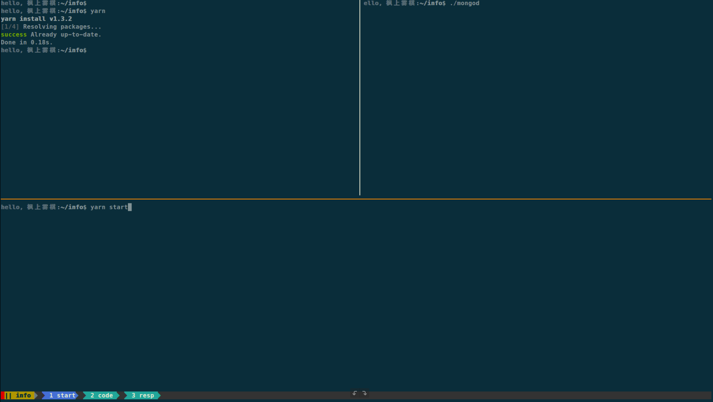

> # to-tmux



# 一个窗口，帮你搞定所有

## 几个重要的概念

- session：会话，一个服务器可以包含多个会话
- window：窗口，一个会话可以包含多个窗口
- pane：面板，一个窗口可以包含多个面板

## session

- 创建会话：`tmux new -s`
- 重新开启会话：`tmux a -t`
- 查看所有会话：`tmux ls`
- 删除某个会话：`tmux kill-session -t`
- 删除所有会话：`tmux kill-server`

```
- 重命名会话：$
- 切换会话：s
- 退出会话：d
- 选择要退出的会话：D
```

## window

- 查看所有窗口：`tmux lsw`
- 交换窗口顺序：`tmux swap-window -s 3 -t 1`

```
- 创建新窗口：c
- 列出所有窗口：w
- 后一个窗口：n
- 前一个窗口：p
- 查找窗口：f
- 重命名当前窗口：,
- 关闭当前窗口：&
- 切换窗口到指定窗口号：窗口号
```

## pane

```
- 垂直分割：%
- 水平分割："
- 切换窗格：o
- 关闭窗格：x
- 查看窗格编号：q
- 窗格最大化：z
- 与上一个窗格交换位置：{
- 与下一个窗格交换位置：}
- 切换窗格布局：space
```

## 其他

```
- 显示时钟：t
- 列出所有快捷键：?
- 命令提示符：:
```
