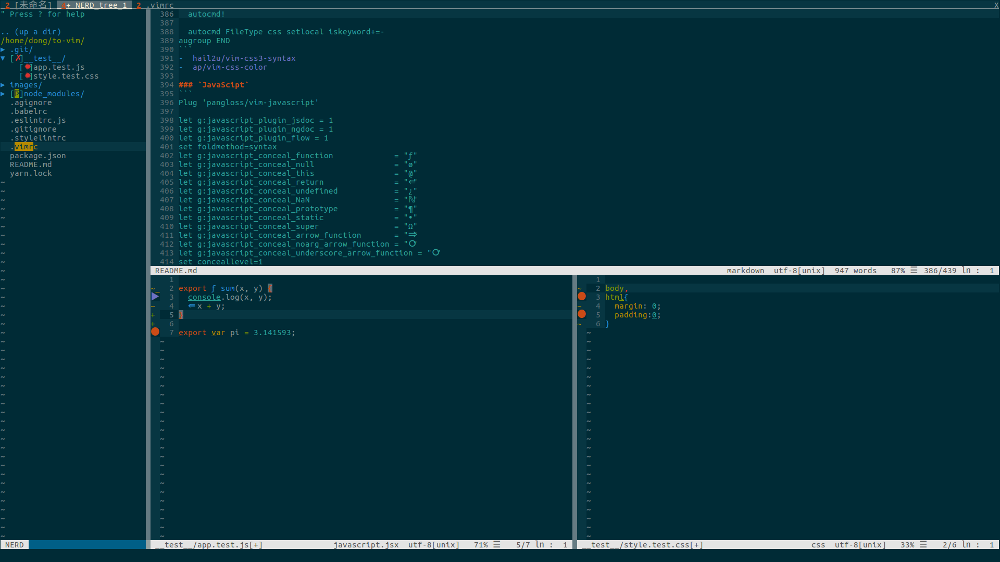

> # to-vim



# 彪悍的编译器，不需要解释

## 安装

```
sudo apt-get install vim  // Ubuntu
```

## 新手指南

```
vimtutor  // vim 教程
```

### `移动光标`

```
# hjkl
# 2w 向前移动两个单词
# 3e 向前移动到第 3 个单词的末尾
# 0 移动到行首
# $ 当前行的末尾
# gg 文件第一行
# G 文件最后一行
# 行号+G 指定行
# <ctrl>+o 跳转回之前的位置
# <ctrl>+i 返回跳转之前的位置
```

### `退出`

```
# <esc> 进入正常模式
# :q! 不保存退出
# :wq 保存后退出
```

### `删除`

```
# x 删除当前字符
# dw 删除至当前单词末尾
# de 删除至当前单词末尾，包括当前字符
# d$ 删除至当前行尾
# dd 删除整行
# 2dd 删除两行
```

### `修改`

```
# i 插入文本
# A 当前行末尾添加
# r 替换当前字符
# o 打开新的一行并进入插入模式
```

### `撤销`

```
# u 撤销
# <ctrl>+r 取消撤销
```

### `复制粘贴剪切`

```
# v 进入可视模式
# y 复制
# p 粘贴
# yy 复制当前行
# dd 剪切当前行
```

### `状态`

```
# <ctrl>+g 显示当前行以及文件信息
```

### `查找`

```
# / 正向查找（n：继续查找，N：相反方向继续查找）
# ？ 逆向查找
# % 查找配对的 {，[，(
# :set ic 忽略大小写
# :set noic 取消忽略大小写
# :set hls 匹配项高亮显示
# :set is 显示部分匹配
```

### `替换`

```
# :s/old/new 替换该行第一个匹配串
# :s/old/new/g 替换全行的匹配串
# :%s/old/new/g 替换整个文件的匹配串
```

### `折叠`

```
# zc 折叠
# zC 折叠所有嵌套
# zo 展开折叠
# zO 展开所有折叠嵌套
```

### `执行外部命令`

```
# :!shell 执行外部命令
```

### `分屏`
```
$ Ctrl+W v  // 左右
$ Ctrl+W s  // 上下

# 移动光标
$ Ctrl+W h/j/k/l  // 左/上/下/右

# 移动分屏
$ Ctrl+W H/J/K/L  // 左/上/下/右

# 修改屏幕尺寸
$ Ctrl+W =/+/-
```

## 基本配置

`.vimrc` 是 `Vim` 的配置文件，需要我们自己创建

```
cd
touch .vimrc
```

### `取消备份`

```
set nobackup
set noswapfile
```

### `文件编码`

```
set encoding=utf-8
```

### `显示行号`

```
set number
```

### `取消换行`

```
set nowrap
```

### `显示光标当前位置`

```
set ruler
```

### `设置缩进`

```
set cindent

set tabstop=2
set shiftwidth=2
```

### `突出显示当前行`

```
set cursorline
```

### `查找`

```
set ic
set hls
set is
```

### `左下角显示当前 vim 模式`

```
set showmode
```

### `代码折叠`

```
# 启动 vim 时关闭折叠代码
set nofoldenable
```

### `主题`

```
syntax enable
set background=dark
colorscheme solarized
```

* [altercation/vim-colors-solarized](https://github.com/altercation/vim-colors-solarized)
* [Anthony25/gnome-terminal-colors-solarized](https://github.com/Anthony25/gnome-terminal-colors-solarized)

## 插件配置

使用 [vim-plug](https://github.com/junegunn/vim-plug) 管理插件

### `树形目录`

```
Plug 'scrooloose/nerdtree'
Plug 'jistr/vim-nerdtree-tabs'
Plug 'Xuyuanp/nerdtree-git-plugin'

autocmd vimenter * NERDTree
map <C-n> :NERDTreeToggle<CR>
let NERDTreeMinimalUI = 1
let NERDTreeShowHidden = 1

let g:nerdtree_tabs_open_on_console_startup = 1
let g:nerdtree_tabs_focus_on_files = 1

let g:NERDTreeIndicatorMapCustom = {
    \ "Modified"  : "✹",
    \ "Staged"    : "✚",
    \ "Untracked" : "✭",
    \ "Renamed"   : "➜",
    \ "Unmerged"  : "═",
    \ "Deleted"   : "✖",
    \ "Dirty"     : "✗",
    \ "Clean"     : "✔︎",
    \ 'Ignored'   : '☒',
    \ "Unknown"   : "?"
    \ }

# o 打开关闭文件或目录
# e 以文件管理的方式打开选中的目录
# t 在标签页中打开
# T 在标签页中打开，但光标仍然留在 NERDTree
# r 刷新光标所在的目录
# R 刷新当前根路径
# X 收起所有目录
# p 小写，跳转到光标所在的上一级路径
# P 大写，跳转到当前根路径
# J 到第一个节点
# K 到最后一个节点
# I 显示隐藏文件
# m 显示文件操作菜单
# C 将根路径设置为光标所在的目录
# u 设置上级目录为根路径
# ctrl + w + w 光标自动在左右侧窗口切换
# ctrl + w + r 移动当前窗口的布局位置
# :tabc 关闭当前的 tab
# :tabo   关闭所有其他的 tab
# :tabp   前一个 tab
# :tabn   后一个 tab
# gT      前一个 tab
# gt      后一个 tab
```

* [scrooloose/nerdtree](https://github.com/scrooloose/nerdtree)
* [vim-nerdtree-tabs](https://github.com/jistr/vim-nerdtree-tabs)
* [nerdtree-git-plugin](https://github.com/Xuyuanp/nerdtree-git-plugin)

### `代码，引号，路径补全`

```
Plug 'Valloric/YouCompleteMe'
Plug 'Raimondi/delimitMate'
Plug 'Shougo/deoplete.nvim', { 'do': ':UpdateRemotePlugins' }
```

* [Valloric/YouCompleteMe](https://github.com/Valloric/YouCompleteMe)
* [Raimondi/delimitMate](https://github.com/Raimondi/delimitMate)
* [Shougo/deoplete.nvim](https://github.com/Shougo/deoplete.nvim)

### `语法高亮，检查`

```
Plug 'sheerun/vim-polyglot'
Plug 'w0rp/ale'

let g:ale_linters = {
\	'javascript': ['eslint'],
\	'css': ['stylelint'],
\}
let g:ale_fixers = {
\	'javascript': ['eslint'],
\	'css': ['stylelint'],
\}
let g:ale_fix_on_save = 1

let g:ale_sign_column_always = 1
let g:ale_sign_error = '●'
let g:ale_sign_warning = '▶'

nmap <silent> <C-k> <Plug>(ale_previous_wrap)
nmap <silent> <C-j> <Plug>(ale_next_wrap)
```

* [w0rp/ale](https://github.com/w0rp/ale)
* [sheerun/vim-polyglot](https://github.com/sheerun/vim-polyglot)

### `文件，代码搜索，打开最近打开的文件`

```
Plug 'rking/ag.vim'
Plug 'kien/ctrlp.vim'
Plug 'vim-scripts/mru.vim'

let g:ag_highlight=1
let g:ag_working_path_mode="r"

# :Ag! content

set wildignore+=*.zip,*.exe

let g:ctrlp_map = '<c-p>'
let g:ctrlp_custom_ignore = {
  \ 'dir':  '\v[\/](node_modules|DS_Store|dist|build|coverage)|(\.(git|hg|svn)$)',
  \ 'file': '\v\.(exe|so|dll)$',
  \ }

# <c-r>: 切换匹配模式
# <c-t> or <c-v>, <c-x>：在新的 tab 中打开

let MRU_Exclude_Files = '^/tmp/.*\|^/var/tmp/.*'
let MRU_Window_Height = 15

# :MRU
```

* [kien/ctrlp.vim](https://github.com/kien/ctrlp.vim)
* [ggreer/the_silver_searcher](https://github.com/ggreer/the_silver_searcher)
* [rking/ag.vim](https://github.com/rking/ag.vim)
* [vim-scripts/mru.vim](https://github.com/vim-scripts/mru.vim)

### `加强版状态栏`

```
Plug 'itchyny/lightline.vim'

let g:lightline = {
      \ 'colorscheme': 'powerline',
      \ 'active': {
      \   'left': [ [ 'mode', 'paste' ],
      \             [ 'gitbranch', 'readonly', 'filename', 'modified', 'helloworld' ] ],
      \   'right': [ [ 'lineinfo' ],
      \              [ 'percent' ],
      \              [ 'fileformat', 'fileencoding', 'filetype' ] ]
      \ },
      \ 'component': {
      \   'helloworld': 'Hello, 枫上雾棋!'
      \ },
      \ 'component_function': {
      \   'gitbranch': 'fugitive#head'
      \ },
      \ }
```

* [itchyny/lightline.vim](https://github.com/itchyny/lightline.vim)

### `代码注释`

```
Plug 'scrooloose/nerdcommenter'

# <leader>c<space> 注释/取消注释
# <leader>cc // 注释
# <leader>cm 只用一组符号注释
# <leader>cA 在行尾添加注释
# <leader>c$ /* 注释 */
# <leader>cs /* 块注释 */
# <leader>cy 注释并复制
# <leader>ca 切换　// 和 /* */
# <leader>cu 取消注释

let g:NERDSpaceDelims = 1
let g:NERDDefaultAlign = 'left'
let g:NERDCustomDelimiters = {
			\ 'javascript': { 'left': '//', 'leftAlt': '/**', 'rightAlt': '*/' },
			\ 'less': { 'left': '/**', 'right': '*/' }
		\ }

let g:NERDAltDelims_javascript = 1
let g:NERDDefaultNesting = 0
```

* [scrooloose/nerdcommenter](https://github.com/scrooloose/nerdcommenter)

### `git`

```
Plug 'airblade/vim-gitgutter'
Plug 'tpope/vim-fugitive'
```

* [airblade/vim-gitgutter](https://github.com/airblade/vim-gitgutter)
* [tpope/vim-fugitive](https://github.com/tpope/vim-fugitive)

### `Markdown`

```
Plug 'suan/vim-instant-markdown'
Plug 'junegunn/goyo.vim'
Plug 'amix/vim-zenroom2'

let g:instant_markdown_slow = 1
let g:instant_markdown_autostart = 0
# :InstantMarkdownPreview
```

* [suan/vim-instant-markdown](https://github.com/suan/vim-instant-markdown)
* [junegunn/goyo.vim](https://github.com/junegunn/goyo.vim)
* [amix/vim-zenroom2](https://github.com/amix/vim-zenroom2)

### `Emmet`

```
Plug 'mattn/emmet-vim'

let g:user_emmet_leader_key='<C-Z>'
let g:user_emmet_settings = {
 		\ 'javascript.jsx' : {
    		\ 'extends' : 'jsx',
    	\ },
 		\ }
```

* [mattn/emmet-vim](https://github.com/mattn/emmet-vim)

### `html 5`

```
Plug 'othree/html5.vim'
```

* [othree/html5.vim](https://github.com/othree/html5.vim)

### `css 3`

```
Plug 'hail2u/vim-css3-syntax'
Plug 'ap/vim-css-color'

augroup VimCSS3Syntax
  autocmd!

  autocmd FileType css setlocal iskeyword+=-
augroup END
```

* [hail2u/vim-css3-syntax](https://github.com/hail2u/vim-css3-syntax)
* [ap/vim-css-color](https://github.com/ap/vim-css-color)

### `JavaScipt`

```
Plug 'pangloss/vim-javascript'

let g:javascript_plugin_jsdoc = 1
let g:javascript_plugin_ngdoc = 1
let g:javascript_plugin_flow = 1
set foldmethod=syntax
let g:javascript_conceal_function             = "ƒ"
let g:javascript_conceal_null                 = "ø"
let g:javascript_conceal_this                 = "@"
let g:javascript_conceal_return               = "⇚"
let g:javascript_conceal_undefined            = "¿"
let g:javascript_conceal_NaN                  = "ℕ"
let g:javascript_conceal_prototype            = "¶"
let g:javascript_conceal_static               = "•"
let g:javascript_conceal_super                = "Ω"
let g:javascript_conceal_arrow_function       = "⇒"
let g:javascript_conceal_noarg_arrow_function = "🞅"
let g:javascript_conceal_underscore_arrow_function = "🞅"
set conceallevel=1
```

* [pangloss/vim-javascript](https://github.com/pangloss/vim-javascript)

### `js-beautify`

```
Plug 'maksimr/vim-jsbeautify'

autocmd FileType html noremap <buffer> <c-f> :call HtmlBeautify()<cr>
```

* [js-beautify](http://github.com/maksimr/vim-jsbeautify)

### `React`

```
Plug 'mxw/vim-jsx'

let g:jsx_ext_required = 0
```

* [mxw/vim-jsx](https://github.com/mxw/vim-jsx)

### `Prettier`

```
Plug 'prettier/vim-prettier', {
  \ 'do': 'yarn install',
  \ 'for': ['javascript', 'typescript', 'css', 'less', 'scss', 'json', 'graphql', 'markdown] }

let g:prettier#config#bracket_spacing = 'true'
let g:prettier#config#jsx_bracket_same_line = 'false'
let g:prettier#autoformat = 0
autocmd BufWritePre *.js,*.jsx,*.mjs,*.ts,*.tsx,*.css,*.less,*.scss,*.json,*.graphql PrettierAsync

# :Prettier
```

* [prettier/vim-prettier](https://github.com/prettier/vim-prettier)

### `自动规范化中文排版`

```
Plug 'hotoo/pangu.vim'

# :Pangu
```

* [hotoo/pangu.vim](https://github.com/hotoo/pangu.vim)
