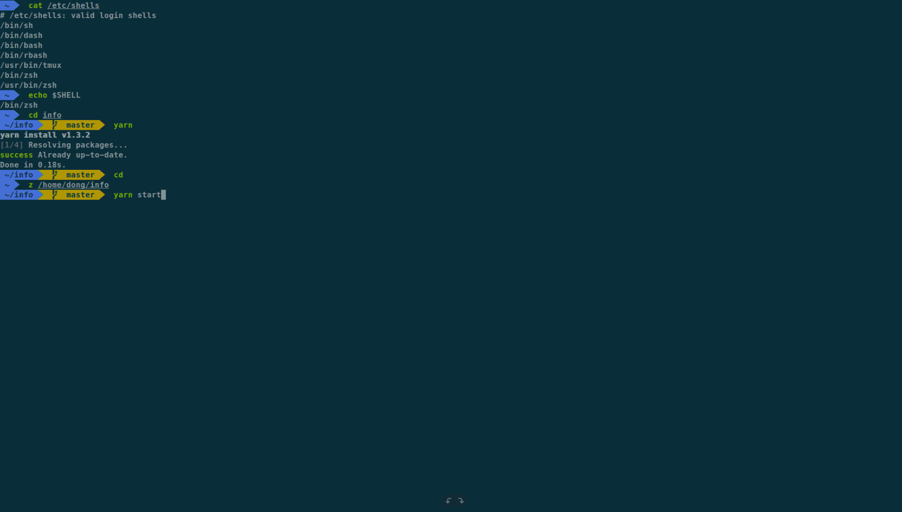

> # to-zsh



# 非常棒的 shell，没理由再使用 bash

## 使用
```
# 查看系统中内置的几种 shell

cat /etc/shells

# 设置 zsh 为默认 shell

chsh -s /bin/zsh

# 查看当前 shell

echo $SHELL
```

## [oh-my-zsh](https://ohmyz.sh/)

### 修改 PS1

```
- 进入 agnoster 主题
- 删除 prompt_context
```

### Plugin

[`git`](https://github.com/robbyrussell/oh-my-zsh/blob/master/plugins/git/README.md)

```
$ g         // git
$ gst       // git status
$ ga        // git add
$ gc!       // git commit -v --amend
$ gcmsg     // git commit -m
$ gup       // git pull --rebase
$ ggp       // git push origin
$ glo       // git log --oneline --decorate
```

[`npm`](https://github.com/ohmyzsh/ohmyzsh/blob/master/plugins/npm/README.md)

```
$ npmg         // npm i -g
$ npmS         // npm i -S
$ npmD         // npm i -D
$ npmO         // npm outdated
$ npmL0        // npm ls --depth=0
$ npmst        // npm start
$ npmt         // npm test
$ npmR         // npm run
```

[`tmux`](https://github.com/ohmyzsh/ohmyzsh/blob/master/plugins/npm/README.md)

```
$ ta            // tmux attach -t
$ tkss          // tmux kill-session -t
$ tksv          // tmux kill-server
$ ts            // tmux new-session -s
$ tl            // tmux list-sessions
```